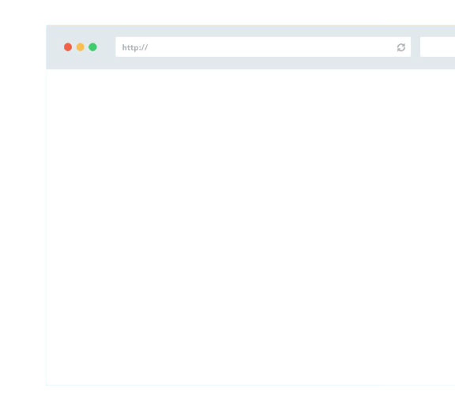

<!-- Banner -->
<!-- Note: The "styleN" class below should match that of the header element. -->
<section id="banner" class="style3">
	

		
			
		
		<header class="major">
			<h1>Mettiamoci in contatto</h1>
		</header>
		

			
{{ page.description }}

			<ul class="actions">
				<li><a href="#contact" class="button next scrolly">Contattami</a></li>
			</ul>
		

	

</section>

<!-- Main -->

<!-- One -->
<section id="one">
	

		<header class="major">
			<h2>Tool per la tua professionalit&agrave;</h2>
		</header>
		
Trendo Web è il fornitore di servizi per freelance imprenditori e piccole imprese leader per soluzioni di internet marketing e di presentazioni.

	

</section>

<!-- Tree -->
<section id="tree" class="spotlights">
	<section>
		
		

			

				<header class="major">
					<h3>Per Imprenditori e precursori  ad ampia visione</h3>
				</header>
				
Ho sviluppato prodotti a cui si affidano oltre 100 Player del mercato italiano ed internazionale.

			

		

	</section>
	<section>
		
		

			

				<header class="major">
					<h3>Grandi visioni richiedono  grande organizzazione</h3>
				</header>
				
Con Trendo Web potrai supportare intuizioni attuabili e razionalizzazione di flussi di lavoro, in modo da sfornare una serie di prodotti atti a generare risultati in termini di vendita e conversione.

			

		

	</section>

	<section>
		
		

			

				<header class="major">
					<h3>Web Master</h3>
				</header>
				
Utilizzo le ultime tecnologie di hosting su internet per permettere hai tuoi prodotti di avere una marcia in pi&ugrave; rispetto la concorrenza per prodotti con maggiore robustezza, sicurezza, versatilit&agrave;, velocit&agrave; e grazia.

			

		

</section>

</section>
 
 
<!-- Banner -->
<!-- Note: The "styleN" class below should match that of the header element. -->
<section id="banner" class="style3">
	

		
			
		
		<header class="major">
			<h1>Vuoi vedere i nostri prodotti web in azione?</h1>
		</header>
		

			
Passa dalla <a href="/">home page</a> di Trendo Web per scoprire tutti i tipi di prodotto o servizio che offro

		

	

</section>
